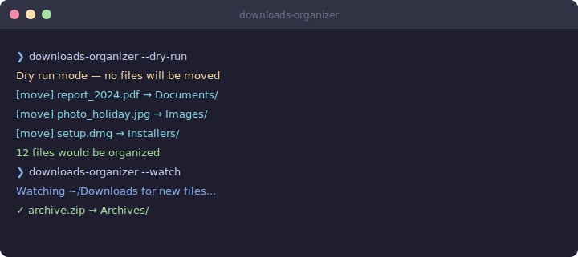

        # downloads-organizer

        [English](README.md) | **中文**

        按文件类型自动整理下载目录——支持实时监控与预演模式。

        [](https://python.org)
        [](LICENSE)

        ---

        

        ---

        ## 功能一览

        | 功能 | 说明 |
        |------|------|
        | **实时监控** | 监控下载目录，新文件到达即自动整理 |
| **一键整理** | 手动触发对所有现有文件的分类 |
| **预演模式** | 在实际移动前预览将要执行的操作 |
| **可自定义分类** | 8 种内置类型（图片、文档、压缩包等）+ 完全可配置 |
| **跨平台** | 支持 macOS、Windows 和 Linux |

        ## 安装

        ```bash
        pip install downloads-organizer
        ```

        ## 快速开始

        ```bash
        downloads-organizer --watch
        ```

        ## 环境要求

        - Python 3.9+
        - 详见 requirements.txt

        ## License

        MIT
